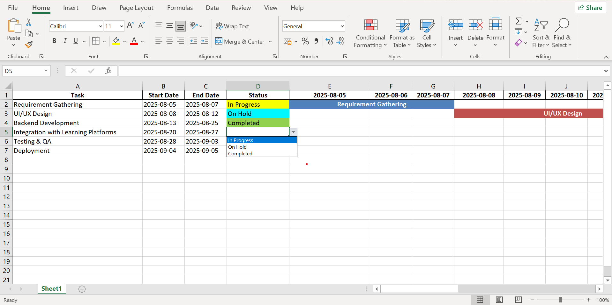

# Business Analyst Agent 

A multi-agentic system to streamline tasks typically handled by Business Analysts. 
This system leverages LLMs, Google Agent Development Kit (ADK), and custom tools to generate structured documents like BRDs, use case specifications, Gantt charts, and user manuals — in seconds.

---

## Overview

Business Analysts often spend hours creating repetitive documentation. This project automates and accelerates that workflow using a central Business Analyst Orchestrator Agent coordinating multiple sub-agents.
The system was built as a weekend side project to explore GenAI + multi-agent architectures.

---

## 🛠️ Built With

- **Google Agent Development Kit (ADK)** – Multi-agent orchestration  
- **Gemini 2 Flash Model** – LLM used as the reasoning engine  
- **Streamlit** – Interactive frontend UI  
- **Render** – Deployment platform  
- **Python Libraries** – `openpyxl`, `reportlab`, `pypdf`, and more for document generation

---

##  Agent Architecture


Each sub-agent is responsible for generating a specific type of documentation, with the orchestrator coordinating tool calls and agent outputs.


## 📄 Features

-  Generate complete Business Requirement Documents (BRD)
-  Create use cases and acceptance criteria
-  Revise existing BRDs with updated inputs
-  Build task planning charts + auto-generate Excel-based Gantt charts
-  Export User Manuals
-  Streamlined output in seconds

---

##  Installation

> ⚠ This project uses Google ADK, which may require specific environment setup. Refer to [Google ADK Setup Guide](https://github.com/google/agent-development-kit) for instructions.

1. Clone the repository:

```bash
git clone https://github.com/AdityaTheDev/Business-Analyst-Agent.git
cd Business-Analyst-Agent
python -m venv venv
source venv/bin/activate  # or venv\Scripts\activate on Windows
pip install -r requirements.txt
streamlit run app.py
```

## Screenshots
### 1. Home UI

### 2. BRD Generated

### 3. Usecase and Acceptance Criteria Generated

### 4. User Manual Generated

### 5. Task Chart Generated


## Demo
Watch the demo video showcasing generation of BRD, Usecase & acceptance criteria, User Manual & Task plan or Gantt chart creation, and the multi-agent interaction here:
👉 [Demo Video Link] (add your actual video link)

## 👥 Contributors

- [Aditya H](https://www.linkedin.com/in/aditya26/) – Tech Stack, Building Agent, Designing the Agent Architecture, Deployment
- [Yogesh Karthik](https://www.linkedin.com/in/yogeshkarthik/) – Business Analysis, Documentation Logic, Use Case Design

